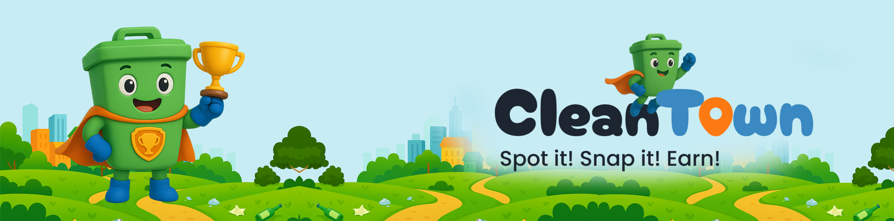
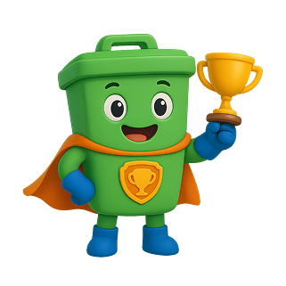
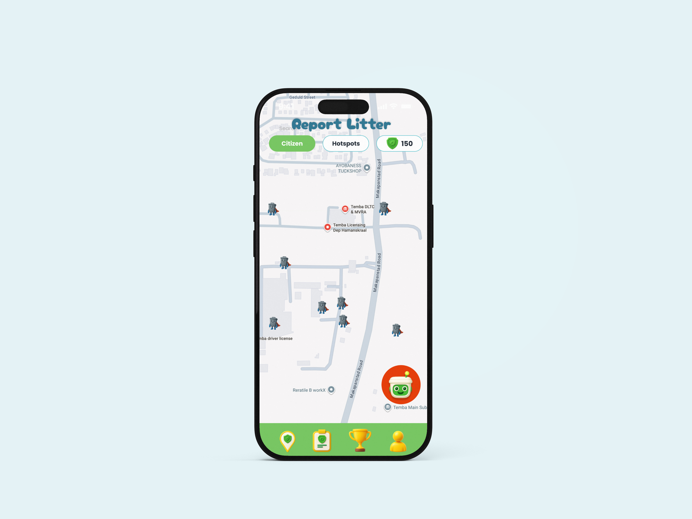
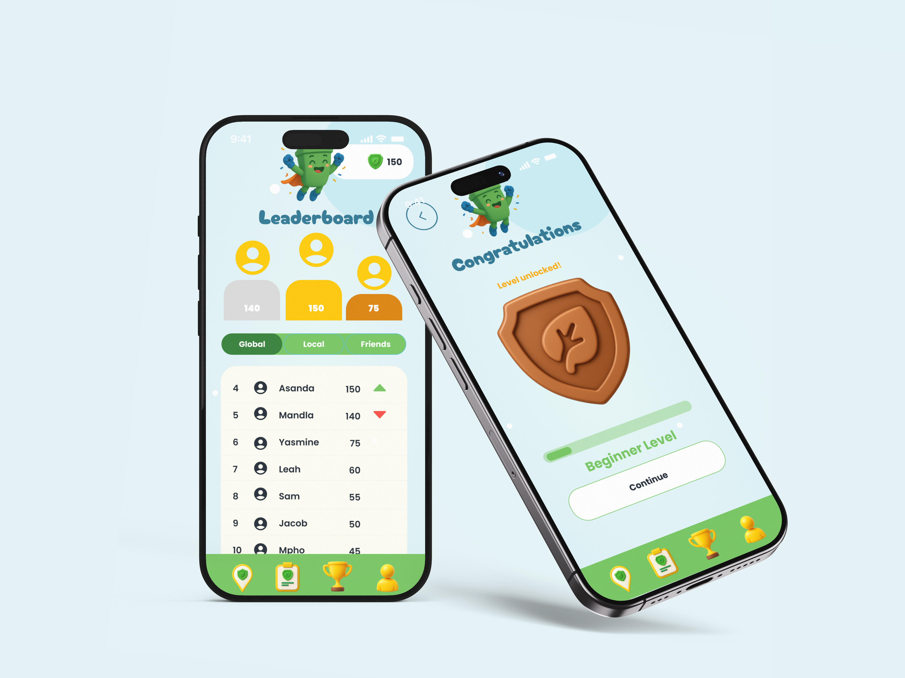
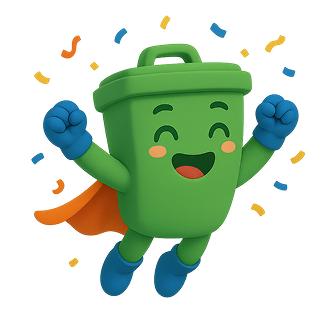
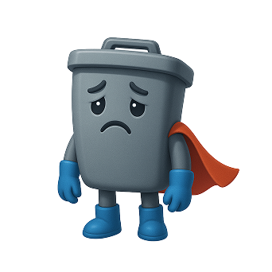
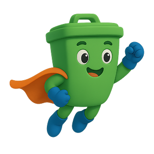
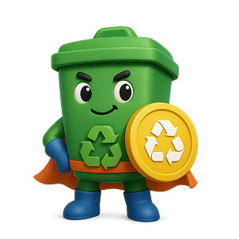
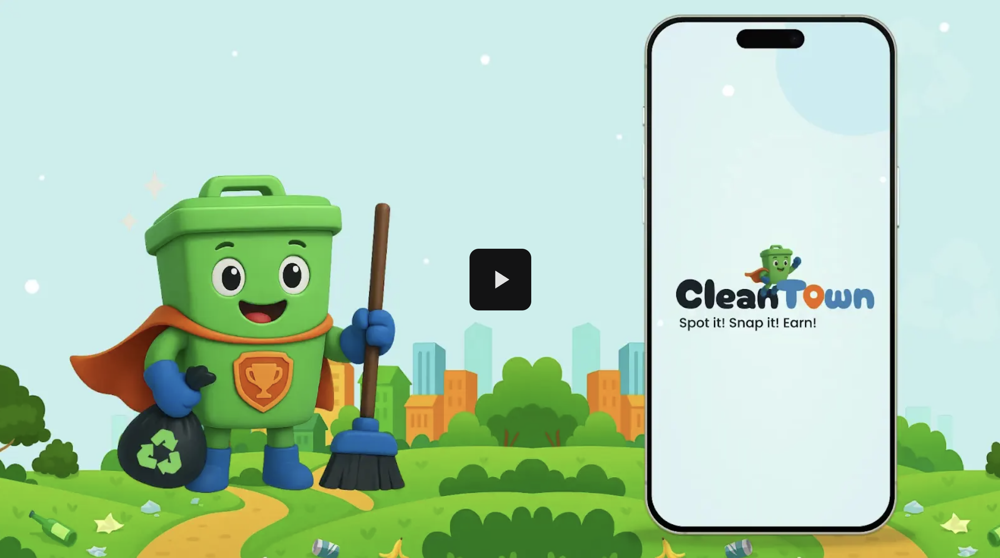

<!-- ===================== -->
<!-- HERO BANNER SECTION   -->
<!-- ===================== -->

<p align="center">
  
</p>

<h2 align="center">CleanTown — AI-Powered Civic Cleanup for Your City</h2>
<p align="center">
  React Native (Expo) · TypeScript · Firebase · Gemini AI · Camera · Location · Civic UX & Gamification
</p>

<!-- ===================== -->
<!-- INTRO WITH GAMIFIED SNAPSHOTS -->
<!-- ===================== -->

## Why CleanTown?

CleanTown turns illegal dumping reports into cooperative civic missions. Capture a photo, GPS pin, and optional audio to alert clean-up crews faster while unlocking XP and eco-hero badges.

- Gemini AI triages each report, estimating volume, category, and suggested cleanup actions.
- Realtime Firestore sync powers the live map, leaderboards, and cleanup scheduler.
- Gamified UX rewards streaks, verified missions, and community cleanups.
- Built with Expo + TypeScript, the app taps into camera, location, audio, and storage APIs for dependable field reporting.

<p align="center">
  
  
  
</p>

<!-- ===================== -->
<!-- GITHUB + TECH BADGES  -->
<!-- ===================== -->

<p align="center">
  <a href="https://github.com/YOUR_GH_USER/CleanTown/fork" target="_blank">
    
  </a>
  <a href="https://github.com/YOUR_GH_USER/CleanTown/stargazers" target="_blank">
    
  </a>
  <a href="https://github.com/YOUR_GH_USER/CleanTown/commits/main" target="_blank">
    
  </a>
  <a href="https://github.com/YOUR_GH_USER/CleanTown/issues" target="_blank">
    
  </a>
  <a href="https://github.com/YOUR_GH_USER/CleanTown/pulls" target="_blank">
    
  </a>
  <a href="https://github.com/YOUR_GH_USER/CleanTown/blob/main/LICENSE" target="_blank">
    
  </a>
</p>

<p align="center">
  
  
  
  
  
  
  
  
  
</p>

---

## Mission Boosts

- **Rapid Deploy:** capture, tag, and send a mission in seconds using Expo camera + GPS.  
- **Squad XP:** neighbourhood leaderboards track weekly clean-team progress.  
- **Eco-Hero Perks:** AI-reviewed missions unlock themed badges, coins, and streak powers.  
- **Cleanup Signals:** Firestore broadcasts alerts to local authorities and volunteer crews.  

## Table of Contents

- [About the Project](#about-the-project)  
- [Mockups](#Mockups)  
- [MVG Features](#mvg-features)  
- [Gamification & Eco-Heroes](#gamification--eco-heroes)  
- [Built With](#built-with)  
- [Firestore Data Model & Security Rules](#firestore-data-model--security-rules)  
- [Prerequisites](#prerequisites)  
- [Getting Started](#getting-started)  
- [Project Features](#project-features)  
- [Development Process](#development-process)  
- [Final Outcome](#final-outcome)  
- [Video Demo](#video-demo)  
- [Conclusion](#conclusion)  
- [Footer](#footer)  
- [References](#references)  

---

## About the Project

CleanTown is a **gamified, community-driven environmental mobile app** that helps users report illegal dumping, litter and waste hotspots in their neighbourhoods.

Users capture a **photo, GPS location and optional audio note**, and submit a “mission” to the system.  
A **Gemini-powered AI service** analyses each report to:

- identify the **waste category** (household, construction, hazardous)  
- estimate **severity & volume**  
- highlight potential **environmental risk**  
- suggest **cleanup actions**

This data powers:

- a **live dumping map**  
- a **cleanup scheduler**  
- **leaderboards & XP progression**  
- **gamified analytics**

---

### Reporting Flow



### Leaderboard & Gamification



---

## MVG Features

- **AI Waste Classification** – Gemini analyses image + context to classify dumping type.  
- **GPS Auto-tagging** – Location auto-attached for every mission.  
- **Photo + Audio Notes** – Rich context for municipal teams and recyclers.  
- **Location Heatmaps** – Visual hotspots for recurring dumping zones.  
- **XP System & Badges** – Players earn points and unlock eco-levels.  
- **Realtime Firestore Sync** – Multi-device, multi-user data in sync.  
- **Cleanup Scheduler** – Plan and track community cleanups.  
- **Offline Draft Reports** – Save missions and sync when back online.  

<p align="center">
  
  
  
</p>

---

## Gamification & Eco-Heroes

<p align="center">
  
  
  
  
  
</p>

<p align="center">
  
  
  
</p>

---

## Built With

### Core Framework & Runtime
- **React** `^19.1.0`  
- **React Native** `^0.81.5`  
- **Expo SDK** `~54.0.0`  
- **TypeScript** `~5.9.2`  
- **Node.js** `>= 18.x`

### Backend, Database & AI
- **Firebase** (Auth, Firestore, Storage)  
- **Google Gemini AI** via `@google/generative-ai`  

### Navigation & State
- `@react-navigation/native`  
- `@react-navigation/bottom-tabs`  
- `@react-navigation/native-stack`  
- `@react-native-async-storage/async-storage`  

### Native & Hardware (Expo APIs)
- `expo-camera` – report photos  
- `expo-image-picker` – gallery uploads  
- `expo-location` – GPS coordinates  
- `expo-av` – audio notes  
- `react-native-maps` – interactive map view  

### UI, Styling & UX
- `@expo-google-fonts/poppins`  
- `@expo-google-fonts/cherry-bomb-one`  
- `@expo/vector-icons`  
- `react-native-reanimated`  
- `react-native-linear-gradient`, `react-native-radial-gradient`  
- `react-native-safe-area-context`  

---

## Firestore Data Model & Security Rules

CleanTown uses Firestore collections for:

- `users` — profiles, points, badges  
- `reports` — illegal dumping reports & AI analysis  
- `cleanupEvents` — community cleanups  
- `pointsTransactions` — XP / rewards log  

### Example Rules

```js
rules_version = '2';
service cloud.firestore {
  match /databases/{database}/documents {
    function isAuthed() { return request.auth != null; }
    function isOwner(uid) { return isAuthed() && request.auth.uid == uid; }

    match /users/{userId} {
      allow read: if true;
      allow create, update: if isOwner(userId);
    }

    match /reports/{id} {
      allow read: if true;
      allow create: if isAuthed() &&
        (request.resource.data.userId == request.auth.uid ||
         request.resource.data.uid == request.auth.uid);

      allow update: if isAuthed() && (
        ((resource.data.userId == request.auth.uid ||
          resource.data.uid == request.auth.uid) &&
          request.resource.data.diff(resource.data).changedKeys()
            .hasOnly(['status','description','category','photoUrl','audioUrl',
                      'updatedAt','hasPhoto','hasAudio','note','type','aiAnalysis']))
        ||
        request.resource.data.diff(resource.data).changedKeys()
          .hasOnly(['confirmations','updatedAt'])
      );

      allow delete: if isOwner(resource.data.userId) || isOwner(resource.data.uid);
    }
  }
}

---

# Prerequisites

To run CleanTown locally, you’ll need both the tooling and cloud access configured ahead of time.

## Software
- Node.js 18+
- Git
- Expo CLI
- Android Studio or Xcode
- Expo Go (mobile)

## Cloud Services & API Keys
- Firebase project (Auth, Firestore, Storage enabled)
- Google Gemini API key
- Create a `.env` file in the project root and store:

```
EXPO_PUBLIC_FIREBASE_API_KEY=<your firebase api key>
EXPO_PUBLIC_GEMINI_API_KEY=<your gemini api key>
```

---

# Getting Started

1. **Clone the repository**
   ```bash
   git clone https://github.com/YOUR_GH_USER/CleanTown.git
   cd CleanTown
   ```
2. **Install dependencies**
   ```bash
   npm install
   ```
3. **Run the Expo development server**
   ```bash
   npm run start
   ```

---

<p align="center">
  
  
  
</p>

---

# Project Features

- AI-powered trash detection and report enrichment
- Realtime Firestore syncing across devices
- Audio notes alongside photo + GPS captures
- XP, leveling, and badges for missions
- Cleanup scheduler and live dumping map
- Gamified mission feed with offline-safe drafts
- Add Dashboard, link municipalities to local Reports

<p align="center">
  
  
  
</p>

---

# Development Process

Document your build journey here (architecture decisions, design sprints, or lessons learned). Keeping this section updated helps collaborators understand context quickly.

---

# Final Outcome

CleanTown transforms environmental reporting into a gamified experience powered by AI.

<p align="center">
  
</p>

---

# Video Demo

<p align="center">
  <a href="https://drive.google.com/file/d/1WMe61b3ln4BBaojFvhz2A130MwoaDMvs/view" target="_blank">
    
  </a>
</p>

---

# Conclusion

CleanTown blends civic responsibility with modern UX and gamified AI systems to foster cleaner communities.

---

# Footer

Built with dedication to cleaner cities.

---

# References

- https://codepen.io/LukyVj/pen/oNPJrdy
- https://genially.com/features/gamification/
