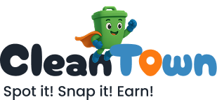

<p align="center">
  
</p>

# Clean Town 👋

## Overview

Clean Town is a gamified civic mobile app designed to combat the growing issue of illegal dumping in South African townships. It enables residents to report litter through geotagged photos, while AI helps classify trash types and identify dumping hotspots. Recyclers can then use smart routes to collect profitable materials, and municipalities gain access to actionable insights for resource allocation.

## The Problem

Illegal dumping in South African townships causes blocked drains, unsafe streets, flooding, pollution, and health risks. Current municipal response is reactive because they lack real-time, location-based data. Township youth view cleaning as punishment, and informal recyclers waste hours roaming aimlessly to find sellable materials.

## The Opportunity

Clean Town presents an opportunity to engage different groups:

*   **Youth:** As tech-savvy and socially active individuals, they can be motivated with recognition and rewards.
*   **Recyclers:** They can benefit from efficient collection routes and pricing information.
*   **Municipalities:** They gain actionable insights and predictive patterns to deploy limited resources effectively.

## Target Market & MVP Users

(Details to be added)

## Get Started

1.  **Install dependencies**

    ```bash
    npm install
    ```

2.  **Start the app**

    ```bash
    npx expo start
    ```
